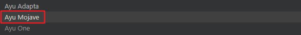
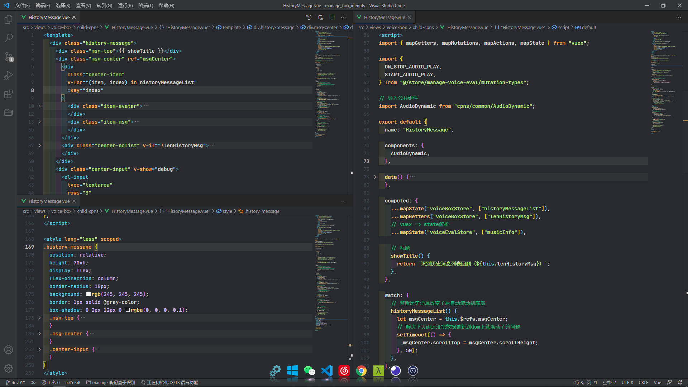
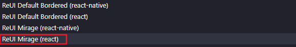
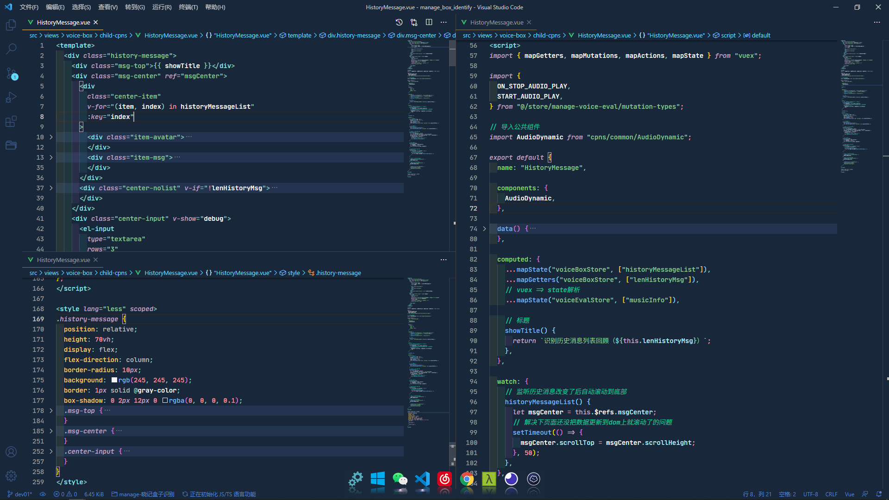
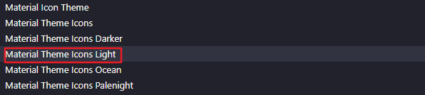
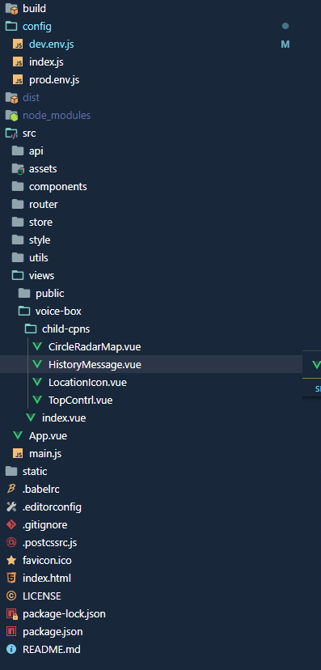
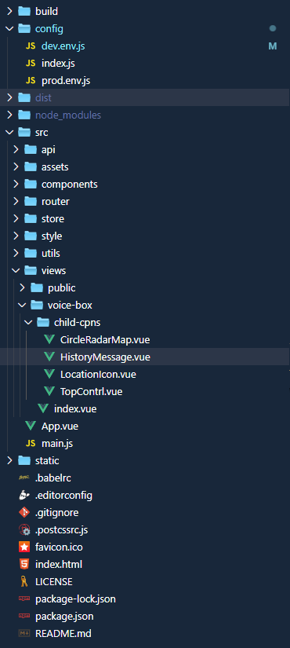

## 1. 主题

### 偏暗黑一点的主题 
```
Ayu Adaptive
```

> 有一整套, 一共有三个可选, 我个人使用的是下面这个, 看个人喜好选择即可, 切换主题快捷键 Ctrl + K 停顿下 Ctrl + T



> 预览效果如下




### 偏蓝黑类型的主题
```
ReUI
```

> 好几个呢, 我用的是下面这个



> 预览效果如下




## 2. 文件图标

### 第一个
```
Material Icon Theme
```

> 预览效果如下






### 第二个 Mac风格
```
vscode-icons-mac
```

> 预览效果如下


