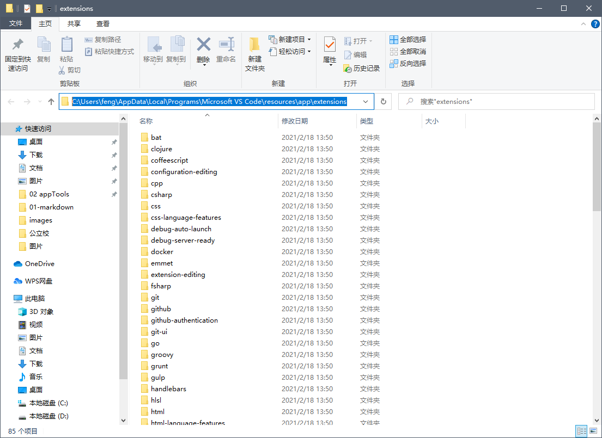
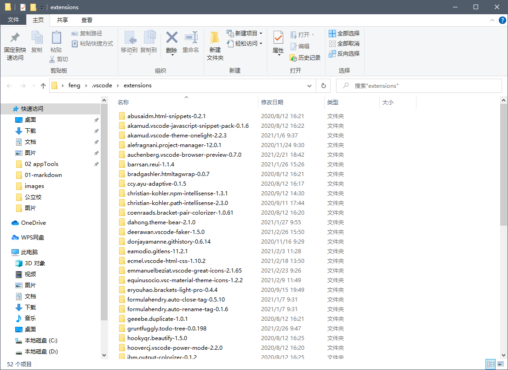
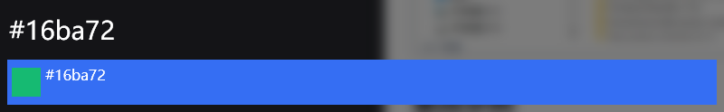
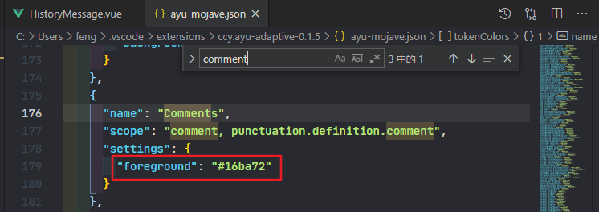

## vscode自带插件目录
> vscode安装目录 + \resources\app\extensions

```
C:\Users\feng\AppData\Local\Programs\Microsoft VS Code\resources\app\extensions
```

> 如下所示




## vscode用户安装插件目录
> 用户根目录(我的是C:\Users\feng, 这里以实际用户为准) + \.vscode\extensions

```
C:\Users\feng\.vscode\extensions
```

> 如下所示




## 更改示例

### 1. 这里以修改 ayu-mojave 主题注释作为演示


### 2. Ctrl + F 查找元素, 修改foreground颜色即可, 搭配主题的话我比较喜欢这个颜色 #16ba72




