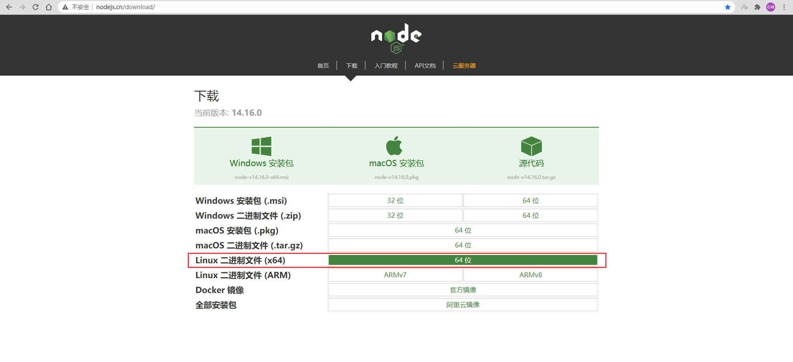
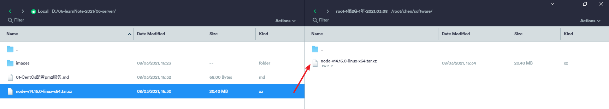
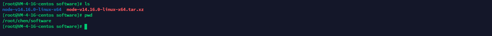
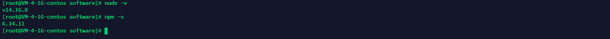

### 安装Node

#### 1.官网下载linux安装包

[Node官网下载](http://nodejs.cn/download/)

> 因为我们需要在CentOs服务器上进行配置, 所以我们选择Linux版本安装包, 如下




#### 2.将下载好的安装包上传至服务器

> 我这边是直接使用`termius`远程服务器连接工具通过sftp直接进行上传的, 当然亦使用其它工具或方式




#### 3.解压安装包

- 解压命令

```shell
tar -xvf node-v14.16.0-linux-x64.tar.xz 
```


#### 4.建立软链接(可以在任何地方使用node与npm命令)

> 先查看自己安装Node安装包的目录(pwd) 我的目录是 /root/chen/software 如果你的不是 下面配置软连接时需要替换掉这个目录为你的



- node

```shell
ln -s /root/chen/software/node-v14.16.0-linux-x64/bin/node /usr/local/bin/
```

- npm

```shell
ln -s /root/chen/software/node-v14.16.0-linux-x64/bin/npm /usr/local/bin/
```


#### 5.使用node与npm命令查看是否安装成功

```shell
node -v
npm -v
```

> 如下所示则为成功




### 安装pm2


### 部署前端项目